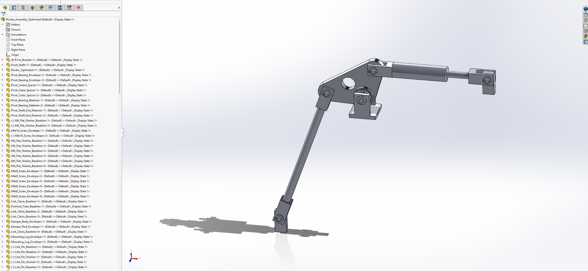
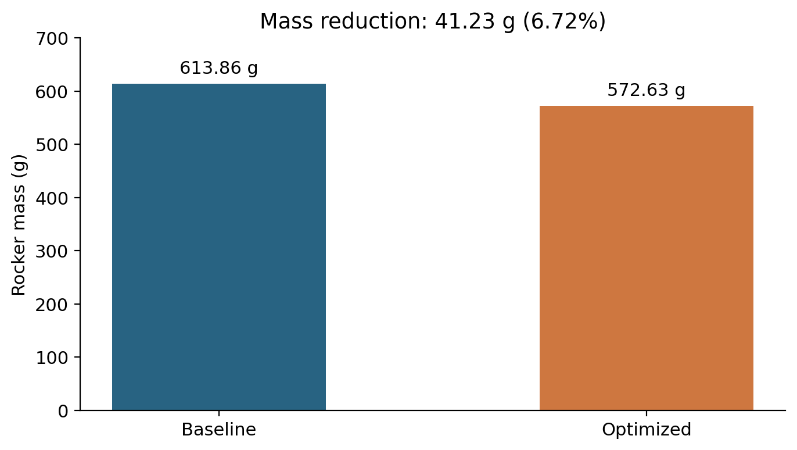
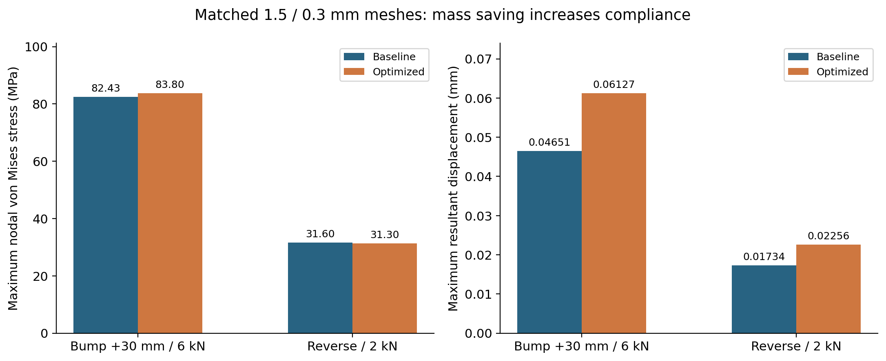
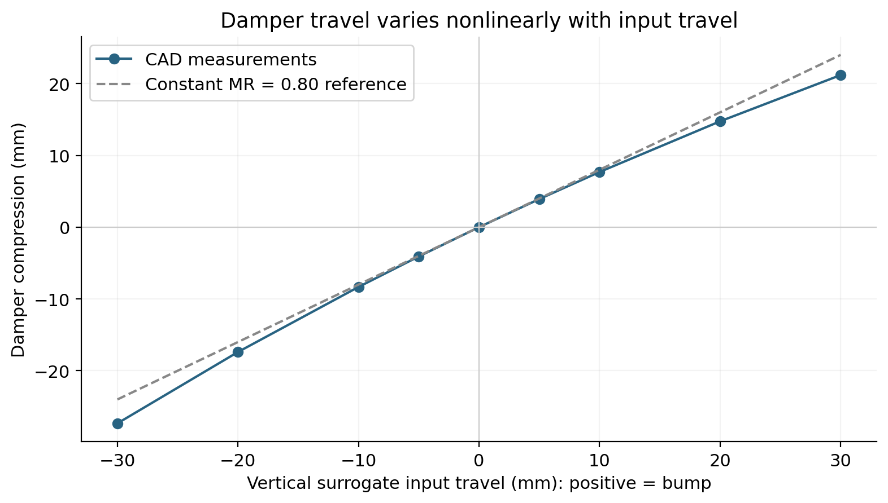
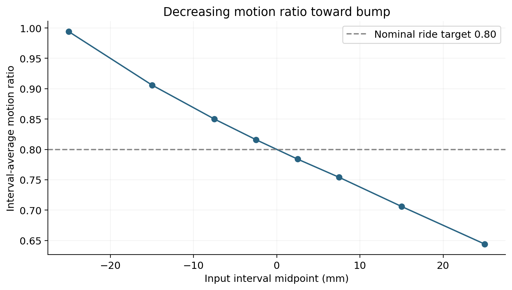
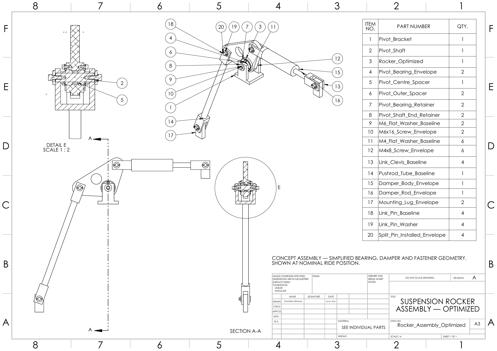

# Suspension Rocker Design, Kinematics and FEA in SolidWorks

**Author:** Chamika Nimsara | **Software:** SolidWorks 2023 | **Completed:** 5 October 2026

A conceptual front-corner pushrod suspension rocker project covering parametric modelling, a serviceable pivot assembly, travel verification, linear static FEA, mesh refinement and a mass-reduction iteration.

The optimized 6061-T6 rocker removes **41.23 g (6.72%)** using a through-hole while retaining the same pickup geometry. The matched-mesh bump comparison shows **1.66% higher peak nodal stress and 31.74% higher maximum displacement**. This is a documented mass/stiffness trade-off, rather than a claim that every performance metric improved.



## Results at a glance

| Quantity | Baseline | Optimized |
|---|---:|---:|
| Rocker body mass | 613.86 g | 572.63 g |
| Bump +30 mm / 6 kN, nodal stress, matched mesh | 82.43 MPa | 83.80 MPa |
| Bump +30 mm / 6 kN, resultant displacement, matched mesh | 0.04651 mm | 0.06127 mm |
| Bump fine-mesh nodal stress | 85.14 MPa | 83.87 MPa |
| Bump fine-mesh resultant displacement | 0.04655 mm | 0.06128 mm |
| Reverse 2 kN nodal stress | 31.60 MPa | 31.30 MPa |
| Reverse 2 kN resultant displacement | 0.01734 mm | 0.02256 mm |

Matched mesh = maximum/minimum mesh size **1.5/0.3 mm**; fine mesh = **1.2/0.24 mm**. Stress is a maximum nodal von Mises result, and displacement is maximum URES, not a measured relative pickup displacement.




## What was built and checked

- Baseline and optimized rocker bodies with unchanged A/O/B pickup locations.
- Pivot shaft, simplified bearings, spacers, retainers, fasteners and double-shear linkage joints.
- Pushrod and telescoping damper envelopes connected to a fixed mount and guided input.
- Nominal ride motion ratio approximately **0.80**, with travel-dependent variation measured from CAD.
- **30 mm bump / 30 mm droop** mechanism sweep; 21.19 mm compression and 27.33 mm extension from ride.
- Baseline ride, bump, droop and reverse bearing-load studies; optimized bump and reverse studies.
- Baseline and optimized bump mesh-refinement comparisons and reaction-force checks.
- Smooth optimized assembly motion reported by the author; no remaining interferences at the three checked positions after eight known thread-envelope overlaps were ignored.
- Optimized rocker and assembly drawings, including BOM and balloons, exported to PDF.




## Read the engineering work

1. [Design basis and final geometry](docs/01_design_basis.md)
2. [Mechanism physics and kinematics](docs/02_kinematics.md)
3. [Loads, FEA setup and mesh checks](docs/03_structural_analysis.md)
4. [Optimization and interpretation](docs/04_optimization.md)
5. [Assembly verification and drawing status](docs/05_verification.md)
6. [Evidence gallery and data provenance](docs/06_evidence.md)
7. [Native files and publishing the repository](docs/07_repository_guide.md)
8. [Engineering Brief](docs/engineering_brief.md)

## Drawings

- [Optimized rocker part drawing](Drawings/Rocker_Optimized.pdf)
- [Optimized assembly drawing and BOM](Drawings/Rocker_Assembly_Optimized.pdf)



## Repository contents

| Folder | Contents |
|---|---|
| `docs/` | Engineering explanations, final assumptions, methods and limitations |
| `Images/` | Drawing previews and selected original project screenshots |
| `Plots/` | Six reproducible figures, each in PNG and SVG |
| `Results/` | CSV records for kinematics, loads, mass, FEA, convergence, BOM and assembly checks; two interference-calculation spreadsheets and the screenshot evidence manifest |
| `Drawings/` | Two exported PDF drawings and their native `.SLDDRW` sources |
| `scripts/` | Python chart generation from the CSV records |
| `CAD/` | 22 native `.SLDPRT` models and two `.SLDASM` assemblies |
| `Simulation/` | Locally copied `.CWR` solver results, `.MFC`/`.SL4` artifacts and logs; `.CWR` and `.LOG` files are ignored by Git |
| `Animations/` | Baseline mechanism travel video, `Rocker_Travel_Baseline.avi` |

## Reproduce the figures

```bash
python -m pip install -r requirements.txt
python scripts/generate_charts.py
```

This recreates the plots from recorded values. It does **not** rerun SolidWorks or reconstruct a solver model. Native CAD, drawing sources, solver artifacts and the baseline animation are present in the local repository folders. The copied assemblies' and drawings' references and the studies' result paths have not been verified as part of this documentation review; see [the repository guide](docs/07_repository_guide.md). Git-ignored solver files are local artifacts and are not included by a normal Git commit.

## Interpretation and scope

The moving lower mount C is a **vertical surrogate input**, not a complete upright/wishbone model. Motion ratio is therefore damper compression per unit guided input travel. The full vehicle's wheel motion ratio would require its actual suspension geometry.

The mechanism has a decreasing motion ratio toward bump; it does not meet a constant 0.80 ±5% target across the whole sweep. Only selected static rocker load cases were analyzed. Bearing life, joint/shaft/bracket strength, chassis attachment, fatigue, impact loads and physical proof testing are outside the completed scope.

Drawings communicate nominal concept geometry; fits, general tolerances and a manufacturing release are not established. The eight ignored overlaps are known simplified screw/thread intersections, not a blanket permission to ignore interference. Grey reference markers in the assembly detail were intentionally retained by the author.

No open-source license has been selected. Choose an appropriate license before inviting reuse of the design or code.
