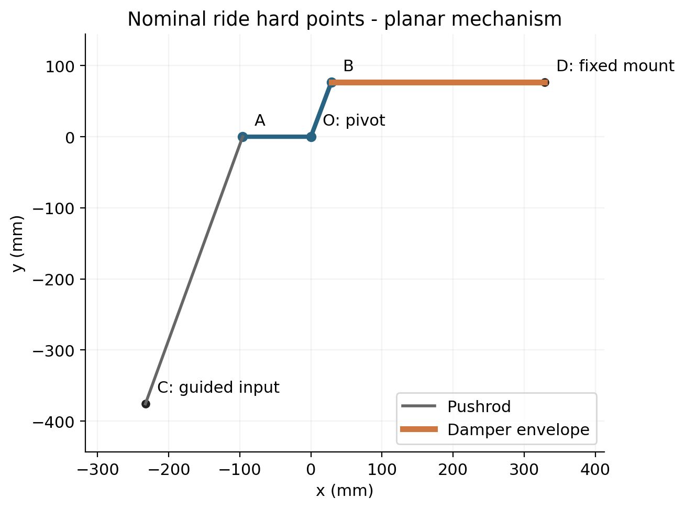

# Design basis and geometry

## Final scope

This portfolio project models one conceptual front-corner rocker mechanism. A rocker is a bell crank: it turns a force and displacement along the pushrod into a force and displacement along the spring/damper axis. The pivot transmits the remaining force to the chassis support.

The CAD project is complete within its stated concept scope. It is not a production suspension or a validated vehicle-specific design. The final material is **6061-T6**, not the 7075-T6 proposed in the early brief.

## Final inputs and assumptions

| Parameter | Adopted value | Interpretation |
|---|---:|---|
| Reference front stiffness | 67,500 N/m | Treated as a wheel-rate reference for the local spring calculation |
| Nominal ride motion ratio | 0.80 | Compression / guided vertical input travel |
| Derived local spring rate | 105.47 N/mm | 67.5 / 0.8²; nominal equivalent, not a purchased spring |
| Mechanism input range | -30 to +30 mm | Negative droop, positive bump |
| Static proof sensitivity input | 6,000 N | Assumed vertical input load, not a measured race load |
| Reverse input | -2,000 N | Assumed load reversal at ride |
| Material E / Poisson ratio | 69,000 MPa / 0.33 | SolidWorks analysis material settings |
| Density | 2,700 kg/m³ | Analysis/CAD material setting |
| Yield / tensile strength | 275 / 310 MPa | Library values, not a billet certificate |

Vehicle mass and track inspired the concept, but do not independently derive the applied 6 kN load. Real sizing would require actual hard points, aero loads, tyre forces, load histories and an operating duty cycle.

## Coordinate convention

O is the rocker pivot, x points right in the layout, y points up and z follows the shaft. All coordinates below are in millimetres and refer to the planar ride layout.

| Point | x | y | Function |
|---|---:|---:|---|
| O | 0 | 0 | Fixed pivot |
| A | -96 | 0 | Pushrod pickup |
| B | 28.73604009 | 76.8 | Damper pickup |
| C | approximately -232.81 | approximately -375.88 | Guided lower pushrod mount |
| D | approximately 328.74 | 76.8 | Fixed damper mount |

OA = 96 mm, OB = 82 mm; pushrod pin-centre length AC = 400 mm and nominal damper pin-centre length BD ≈300 mm. Rounded C/D coordinates are sufficient for interpretation; the saved CAD constraints govern the model.

## Rocker body features

| Feature | Final nominal geometry |
|---|---|
| Plate | 15 mm, mid-plane extrusion |
| Pivot hub | Ø50 mm, 30 mm total axial thickness |
| Pivot through opening | Ø24 mm |
| Bearing seat | Ø26 mm, 9 mm depth on each end |
| Linkage holes | Ø10 mm through |
| Outer profile | Tangent lines linking R25 pickup arcs and R30 pivot profile |
| Retainer pattern | 3 × M4 ×0.7 each side, Ø36 mm PCD, 120° spacing |
| Thread / tap drill depth | 6 / 9 mm each side; Ø3.3 mm drill |
| Optimized window | Ø36 mm through, centre (-40,+30) relative to O |
| Window-to-hub radial clearance | 7 mm nominal: 50 - 25 - 18 |

No fillets were added to the final nominal model. Hole position, root geometry and window placement influence the load path; nominal clearances do not establish manufacturing tolerances or fatigue durability.

## Changes from the early concept

| Early proposal | Completed project |
|---|---|
| 7075-T6 body | 6061-T6 body |
| 50 mm bump / 30 mm droop | Demonstrated ±30 mm guided-input travel |
| Preliminary 95 mm pushrod radius | Final OA = 96 mm |
| Hypothetical 50 N/mm spring example | 105.47 N/mm local spring-rate calculation |
| Constant MR within ±5% as an initial aim | Measured decreasing ratio; departure explicitly documented |
| 0.20-0.30 kg preliminary mass ambition | Baseline 0.61386 kg; optimized 0.57263 kg |
| Proposed blend radii, certified material and release fits | Nominal concept CAD and drawings; those release items remain open |

The early concept brief is not used as final numerical evidence. This document describes what was actually modelled and measured.
