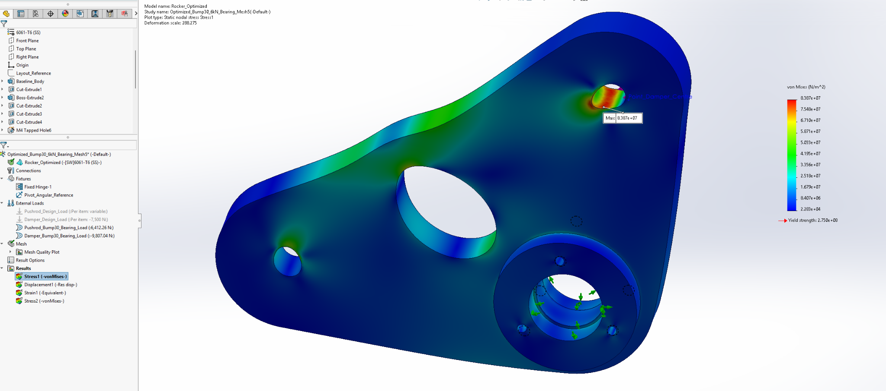
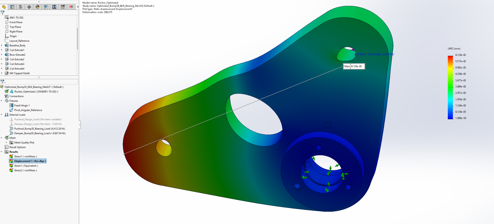
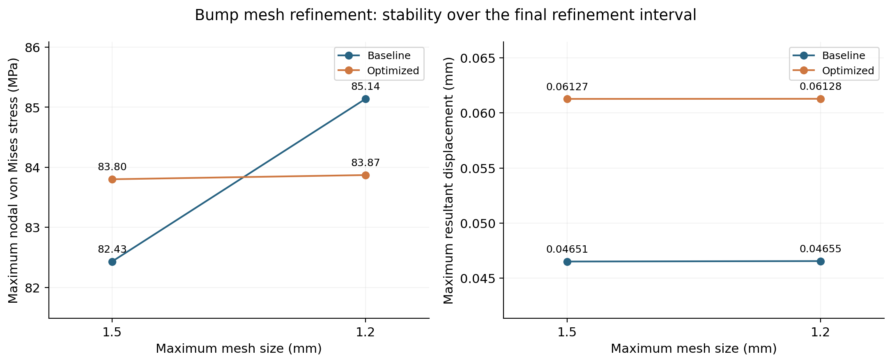

# Loads, structural analysis and mesh checks

## What the analysis represents

Linear elastic static studies were performed on the rocker solid in SolidWorks Simulation. Force inputs are selected concept load cases, not measured wheel loads or dynamic test results. The bearing-load models are the final reported structural studies; preliminary uniform cylindrical traction studies are not mixed into the headline comparison.

A real joint transfers force through contact pressure around a pin. A point force would concentrate the load unrealistically. Distributed bearing loads provide a more representative load direction, although they still do not resolve actual pin flexibility, clearance or nonlinear contact.

## Material and fixtures

- 6061-T6, isotropic linear elasticity: E = 69,000 MPa, ν =0.33, density =2,700 kg/m³.
- Material-library yield/tensile values 275/310 MPa, without certified billet data.
- Fixed Hinge on the two Ø26 mm bearing seats: radial and axial displacement constrained, circumferential freedom retained.
- A small angular-reference fixture at a split-line vertex, approximately (13,0,15) mm, removes the otherwise free rigid rotation about the pivot.
- The angular reference is a numerical stabilizer. Its reaction is checked; it is not a physical chassis attachment.
- Soft springs, inertia relief and large displacement were off; free-body reaction extraction was on.

## Force magnitudes and directions

| Case | Vertical input | Pushrod magnitude | Damper magnitude | Pushrod axis angle, body-fixed | Damper axis angle, body-fixed |
|---|---:|---:|---:|---:|---:|
| Ride proof | +6,000 N | 6,385.07 N | 7,500 N | 70° | 0° |
| +30 mm bump proof | +6,000 N | 6,412.26 N | 9,807.04 N | 86.55° | 19.66° |
| -30 mm droop proof | +6,000 N | 6,420.13 N | 5,728.17 N | 49.65° | -20.42° |
| Ride reverse | -2,000 N | 2,128.36 N | 2,500 N | 70° | 0° |

Angles are link-axis orientations measured from the rocker's body-fixed x axis in the rocker-only FEA model. This frame coincides with the assembly's global frame at ride, but rotates with the rocker during bump and droop. If θ is the rocker rotation from ride, the assembly-global link angle equals the listed body-fixed angle plus θ. For example, at +30 mm bump θ is approximately -17.21°, giving global pushrod/damper angles of approximately 69.34°/2.45°. The vertical input in the table is defined along the assembly's global guided-input axis, not the body-fixed y axis. In proof cases the pushrod force follows the axis from C toward A and the damper force opposes the axis from B toward D; reverse changes both directions. Exact CAD coordinates govern the case. Loads were recalculated at the displaced geometry, rather than applying the ride force unchanged throughout travel.

Moment equilibrium about O requires $F_pe_p=F_de_d$. Ride proof torque magnitude is about 576 N·m. Bump proof torque magnitude is about 614.46 N·m; droop proof approximately 469.71 N·m. Reverse ride torque magnitude is about 192 N·m.

## Reported maximum results

| Design / case | Mesh max/min (mm) | Nodal von Mises (MPa) | URES (mm) | Equivalent strain |
|---|---|---:|---:|---:|
| Baseline ride proof | 1.5/0.3 | 71.70 | 0.04787 | 0.0007846 |
| Baseline reverse | 1.5/0.3 | 31.60 | 0.01734 | 0.0003425 |
| Baseline bump proof | 1.5/0.3 | 82.43 | 0.04651 | 0.0009858 |
| Baseline bump proof, fine | 1.2/0.24 | 85.14 | 0.04655 | 0.001002 |
| Baseline droop proof | 1.5/0.3 | 65.60 | 0.04061 | 0.0007201 |
| Optimized bump proof | 1.5/0.3 | 83.80 | 0.06127 | 0.001001 |
| Optimized bump proof, fine | 1.2/0.24 | 83.87 | 0.06128 | 0.001004 |
| Optimized reverse | 1.5/0.3 | 31.30 | 0.02256 | 0.0003441 |

URES is maximum absolute resultant displacement. It does not establish relative A-to-B deflection, bearing-seat ovalization or complete suspension compliance. Colour plots use automatic contour scales; compare numeric values, not colour intensity. Displayed deformation is magnified by the plot scale, not actual movement.

## Mesh and convergence

High-quality solid blended curvature-based meshing was used, with Jacobian checks at 16 points, 16 elements around a circle and growth ratio 1.4. The final refinement interval is summarized below.

| Design | Coarse nodes / elements | Fine nodes / elements | Stress change | URES change | Strain change |
|---|---|---|---:|---:|---:|
| Baseline bump | 784,424 / 554,512 | 1,342,608 / 956,878 | +3.29% | +0.086% | +1.64% |
| Optimized bump | 748,824 / 527,910 | 1,267,794 / 901,045 | +0.084% | +0.016% | +0.300% |

The adopted project check was less than 5% change in stress and 2% in displacement over the final refinement. Both pass that numerical check. Baseline fine maximum aspect ratio was 5.1419, optimized fine 5.2676, with no reported distorted elements or aspect ratios above 10. This documents stability across the final interval; it does not prove exact stress convergence, eliminate singularities or validate the fixture model.

## Equilibrium and stabilization checks

For the optimized fine bump case, the expected net pivot reaction in the same body-fixed FEA frame is approximately (8849.47,-3101.18,0) N. The extracted result in that frame was (8849.6,-3101.3,+0.0698) N. These components are not expressed in the assembly's global frame at bump. The angular-reference resultant was approximately **0.411 N**, with pivot-axis moment approximately **0.00276 N·m**, small compared with the applied 614.46 N·m torque magnitude. This supports that the stabilizer was not carrying a material fraction of the intended load.

The optimized reverse angular-reference resultant was approximately 0.310 N with pivot-axis moment -0.00281 N·m. The baseline fine bump reference resultant was approximately 0.265 N with pivot-axis moment 0.000501 N·m. Reaction agreement is a model consistency check, not proof of physical correctness.

## Limits

No optimized ride/droop study or reverse mesh-refinement sequence is claimed. Bump was the largest-stress baseline case tested and was selected for the optimized refinement. All assembly hardware remains outside the rocker-only stress assessment. No fatigue spectrum, modal analysis, buckling study, impact simulation, nonlinear contact study or physical testing is included. A yield-strength/peak-stress quotient alone would not establish a safe vehicle design.
