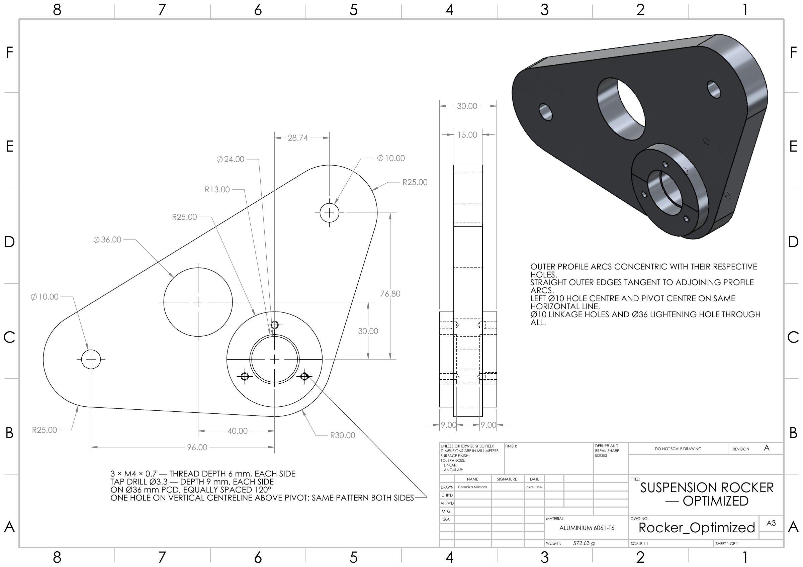

# Assembly verification and drawings

## Mechanism and hardware

The pivot assembly includes a fixed bracket, Ø15 mm shaft, two bearing envelopes, centre/outer spacers, bearing retainers and end retainers. Four clevis joints connect the pushrod, rocker, damper and mounting lugs. Pins pass through double-shear ears; washers and installed split-pin envelopes illustrate retention.

These are geometric envelopes rather than certified catalogue components. In particular the damper is a telescoping body/rod envelope, without a physical spring, piston or catalogue stroke rating. The bearing proxy does not establish its load rating, fits or oscillatory life. The bracket and remote lugs do not include validated chassis attachment details.

## Motion and interference evidence

| Optimized position | Guided input | Known overlaps ignored | Remaining interferences |
|---|---:|---:|---:|
| Nominal ride | 0 mm | 8 | 0 |
| Bump | +30 mm | 8 | 0 |
| Droop | -30 mm | 8 | 0 |

The author confirmed smooth complete optimized movement. The eight ignored intersections are two M6 and six M4 simplified screw/thread envelope overlaps. Treat coincidence as interference was off, hidden components were not excluded and no other components were excluded. These are discrete-position interference checks; smooth dragging is not a continuous collision-detection proof or a tolerance-clearance check.

The baseline mechanism was also checked at ride and ±10/±20/±30 mm input positions. Mate Controller positions and the baseline animation were exercised; the author confirmed that the saved video played correctly. The video is now included as [Rocker_Travel_Baseline.avi](../Animations/Rocker_Travel_Baseline.avi); playback of the repository copy was not checked as part of this documentation review. No physical assembly has been tested.

## Drawings

- [Rocker part](../Drawings/Rocker_Optimized.pdf): A3, scale 1:1, nominal profile/hole dimensions, plate/hub thickness, threaded retainer pattern, material and body mass.
- [Assembly](../Drawings/Rocker_Assembly_Optimized.pdf): A3, overall scale 1:4, section A-A, detail E at 1:2, 20-item BOM and balloons.

The part drawing uses R13 for the Ø26 seat and includes its axial depths. The assembly material field references individual parts, and assembly weight is intentionally blank because rocker body mass is not total assembly mass.

The PDFs were visually reviewed for clipping and readable layout. Grey reference markers in assembly detail E were retained at the author's request. General tolerances, bearing fits, datums/GD&T, certified material and complete component drawings are not established, so these are concept drawings rather than released manufacturing instructions.

## Completed and open work

Completed: CAD bodies, baseline/optimized assemblies, guided travel study, selected rocker static FEA, final bump mesh-refinement checks, nominal drawings and PDF export.

Open for a real vehicle: actual hard-point confirmation, steering and full suspension sweep, duty-cycle loads, spring/damper selection, minimum clearance, hardware/chassis assessment, fatigue, proof testing and manufacturing release.
