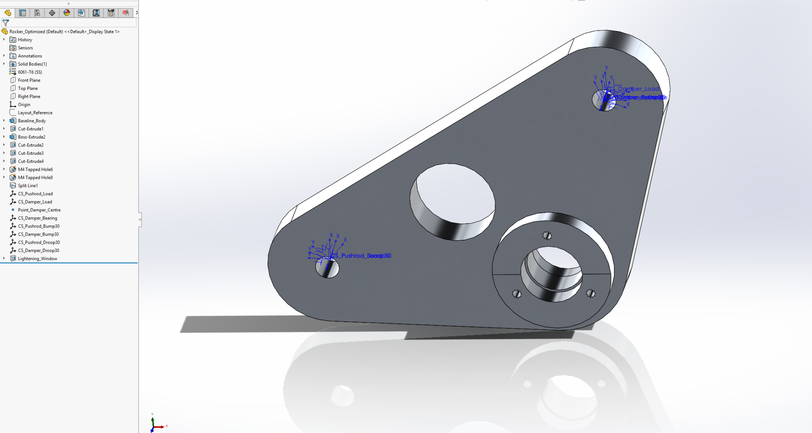
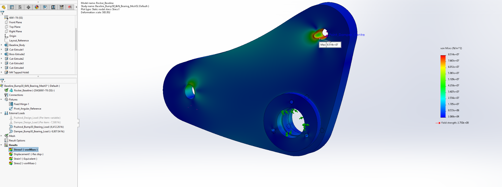
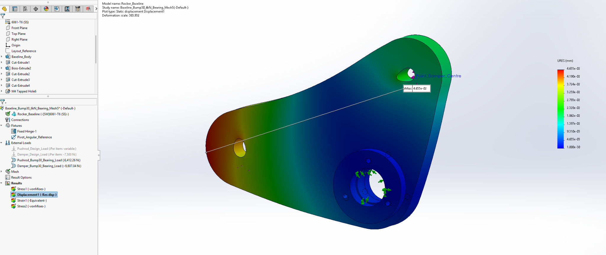
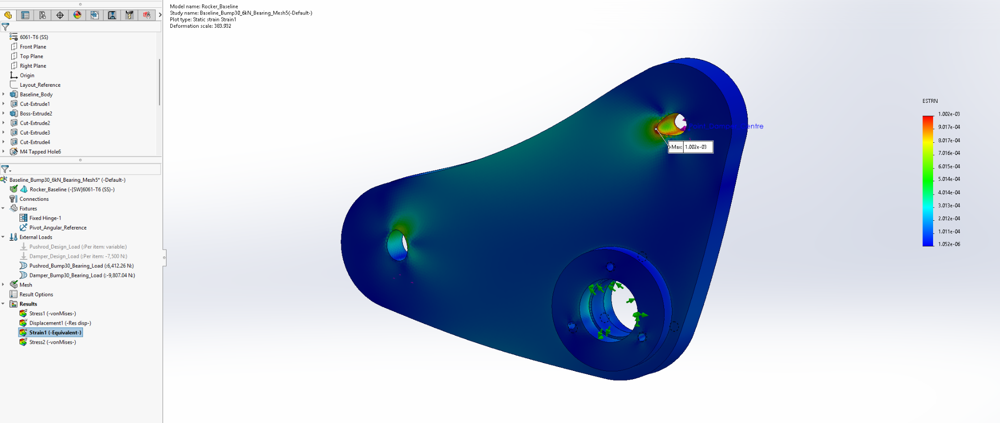
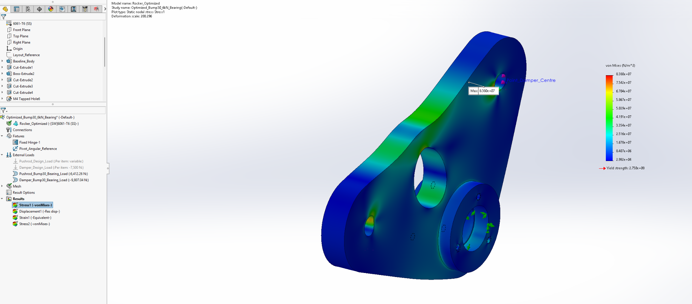
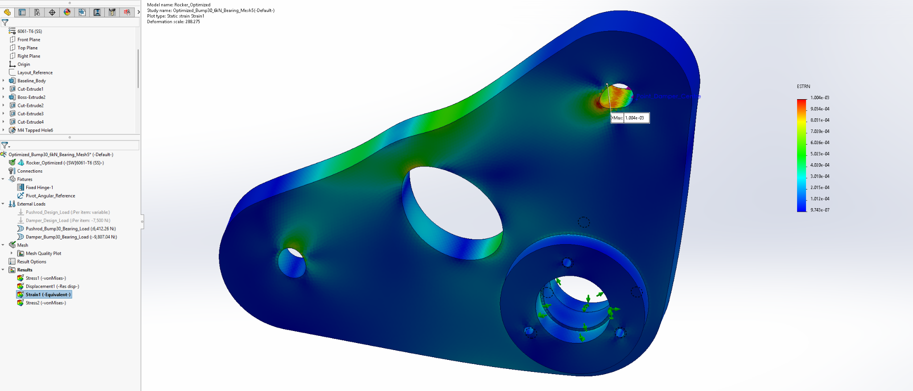
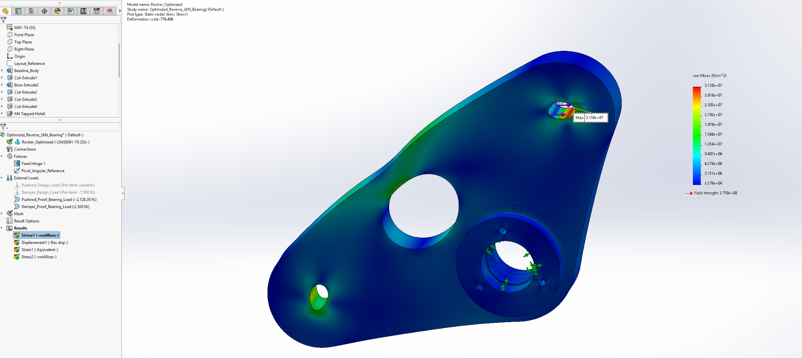
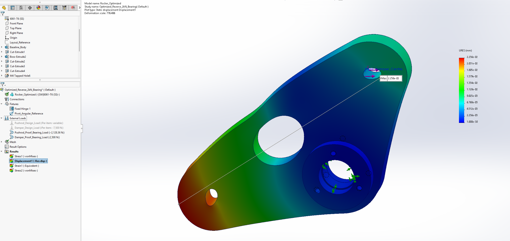
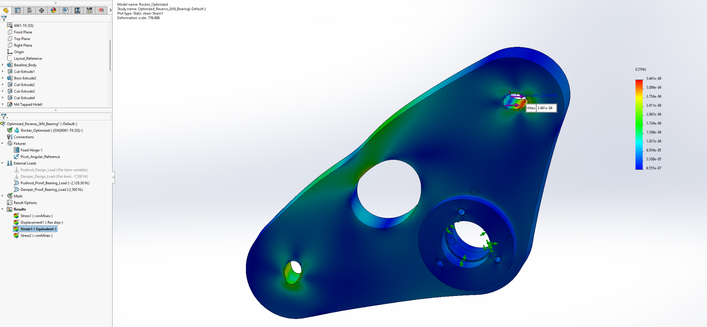

# Evidence gallery and provenance

The numeric CSV records were transcribed from the completed project conversation and supplied SolidWorks screenshots. They are rounded reported results, not raw solver exports. The plot-generation script performs calculations and visualization only.

Selected original screenshots below are retained without alteration; their source names and SHA-256 hashes are in [the evidence manifest](../Results/evidence_manifest.json). Fine-mesh stress and displacement values were visually checked against the included plots during packaging. Other numerical records derive from the recorded project results.

## Optimized assembly at nominal ride position

## Optimized rocker geometry and feature tree

## Baseline bump, fine mesh: nodal von Mises 85.14 MPa

## Baseline bump, fine mesh: URES 0.04655 mm

## Baseline bump, fine mesh: ESTRN 0.001002

## Optimized bump, coarse mesh: nodal von Mises 83.80 MPa

## Optimized bump, fine mesh: nodal von Mises 83.87 MPa

## Optimized bump, fine mesh: URES 0.06128 mm

## Optimized bump, fine mesh: ESTRN 0.001004

## Optimized reverse: nodal von Mises 31.30 MPa

## Optimized reverse: URES 0.02256 mm

## Optimized reverse: ESTRN 0.0003441

## Reading the screenshots

Colour legends for stress are in N/m² (Pa): divide by 10⁶ for MPa. URES is in mm and ESTRN is dimensionless. Contour scales and displayed deformation magnifications vary between plots. Screenshot asterisks may indicate an unsaved document state at capture time; the final rebuild/save was performed later. Screenshots are evidence snapshots, not executable analysis files.

## Data index

- `kinematics.csv`: guided input and damper travel.
- `motion_ratio_intervals.csv`: derived Δs/Δq across every recorded interval.
- `mass.csv`: rocker-only CAD mass/volume.
- `load_cases.csv`: conceptual force inputs and local axis directions.
- `fea_results.csv`: maximum plot values and mesh statistics.
- `mesh_convergence.csv`: derived final refinement changes.
- `bom.csv`: assembly drawing items and quantities.
- `assembly_checks.csv`: author-confirmed optimized interference checks.

There are no simulated time histories or physical test measurements in this dataset.
